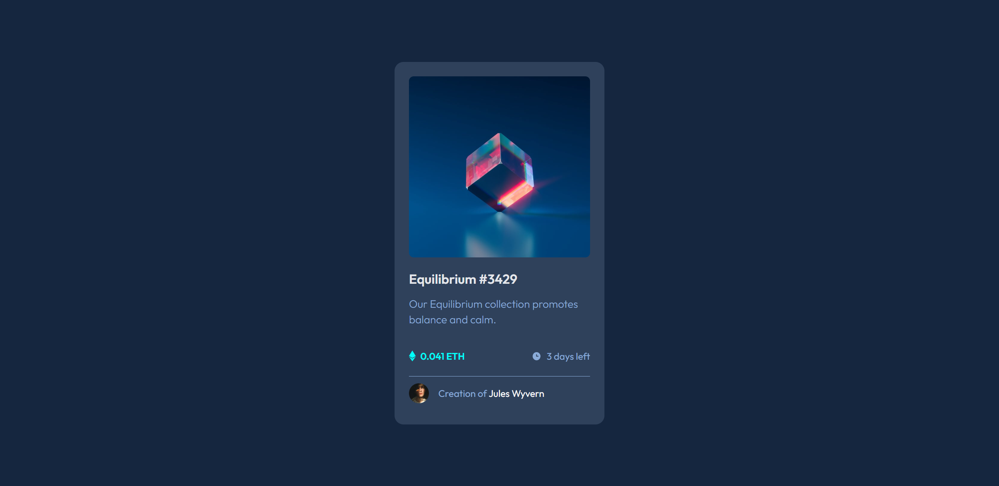

# Frontend Mentor - NFT preview card component solution

This is a solution to the [NFT preview card component challenge on Frontend Mentor](https://www.frontendmentor.io/challenges/nft-preview-card-component-SbdUL_w0U). Frontend Mentor challenges help you improve your coding skills by building realistic projects.

## Table of contents

-   [Overview](#overview)
    -   [The challenge](#the-challenge)
    -   [Screenshot](#screenshot)
    -   [Links](#links)
-   [Author](#author)

## Overview

### The challenge

Users should be able to:

-   View the optimal layout depending on their device's screen size
-   See hover states for interactive elements

### Screenshot

### Links

-   [Solution](https://your-solution-url.com)
-   [Live Site](https://gorgeous-maamoul-31d952.netlify.app)

### Built with

-   Semantic HTML5 markup
-   CSS custom properties
-   CSS Grid
-   Mobile-first workflow
-   [React](https://reactjs.org/) - JS library

## Author

-   Github - [NataJenkins](https://github.com/NataJenkins)
-   Frontend Mentor - [@NataJenkins](https://www.frontendmentor.io/profile/NataJenkins)
-   Linkedin - [natalia0896](https://www.linkedin.com/in/natalia0896/)
